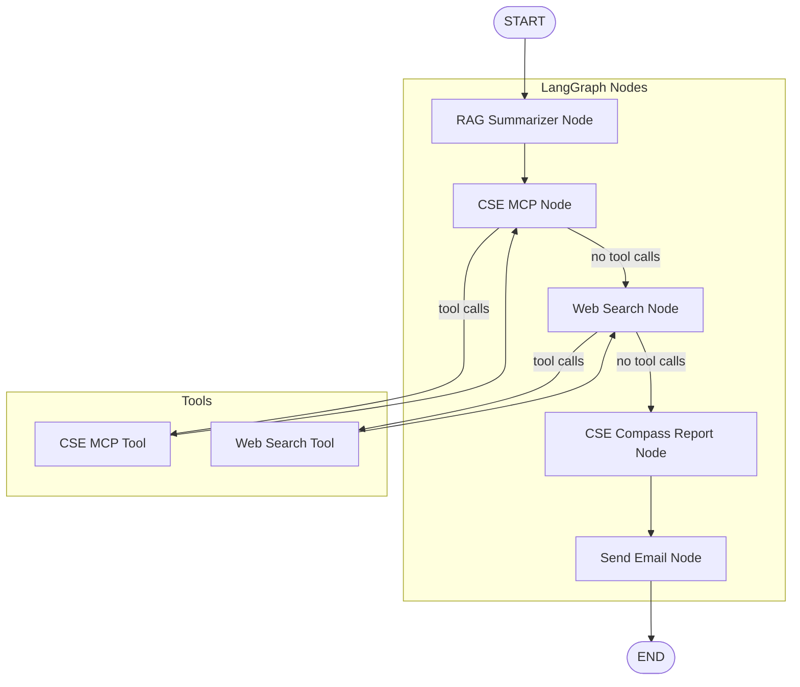

# CSE Compass

An AI agentic application built with **LangGraph** that suggests Colombo Stock Exchange (CSE) stock trading recommendations. The system takes minimal user input—**company name** and **intent** (BUY/SELL)—and produces evidence-grounded analysis by orchestrating RAG, market data, web search, and report generation.

## Overview

CSE Compass uses LangGraph to create a multi-node agent pipeline that:

- Retrieves financial signals from ingested company reports (RAG)
- Fetches live market data via CSE MCP tools
- Searches the web for recent news, CSE updates, Sri Lanka macro, and global risks
- Synthesizes an analytical report with a clear recommendation
- Optionally sends the report via email

## User Inputs

| Input | Description |
|------|-------------|
| **Company name** | e.g. "John Keells Holdings" |
| **Intent** | `BUY` or `SELL` |

Optional: `buy_price` (for SELL intent, to compute approximate P/L).

## LangGraph Architecture

The application is structured as a LangGraph state machine with the following nodes:



### Node Descriptions

| Node | Purpose |
|------|---------|
| **rag_summarizer_node** | Queries RAG over financial reports, extracts signals (revenue, profitability, debt, cash flow, risks), and produces a structured summary |
| **cse_mcp_node** | Calls CSE MCP tools for live market data (price, change, change %); may loop via CSE MCP Tool until data is retrieved |
| **CSE MCP Tool** | Executes CSE MCP market data tool calls |
| **web_search_node** | Plans and runs web searches for company news, CSE market updates, Sri Lanka macro, and global risks; may loop via Web Search Tool |
| **Web Search Tool** | Executes web search tool calls |
| **cse_compass_report_node** | Combines RAG summary, market data, and web results into a JSON report (confidence, decision, key points, risks, watchlist triggers, email draft) |
| **send_email_node** | Sends the report via email using the configured email tool |

## Run

```bash
python3 -m cse_compass.graphs.graph
```

Ensure `.env` contains your API keys (OpenAI, Serper, SendGrid, etc.) and that the CSE MCP server is available.
